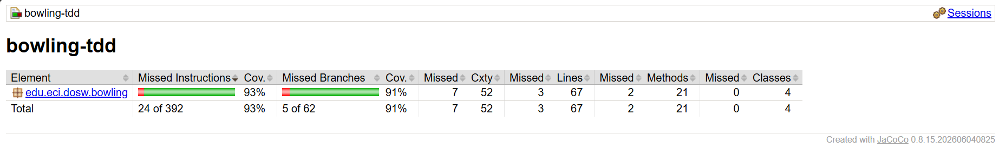
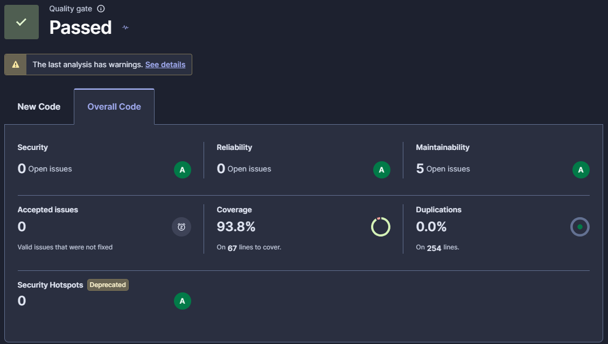

# DOSW-Taller2-Bowling-Villamizar-Daniel
## Desarrollo y Operaciones de Software - Segundo Corte - Taller 2

- Nombre Completo: Daniel José Villamizar Castellanos 
- Código Estudiantil: 1000102992 
- Correo Institucional: daniel.villamizar-c@mail.escuelaing.edu.co

---

## Descripción
### ¿Qué es BowlTech?
BowlTech S.A.S. es una iniciativa orientada a digitalizar el sistema de puntuación para pistas de bolos. El objetivo principal es reemplazar los procesos manuales propensos a fallos humanos —como el olvido de bonificaciones en strikes, confusiones en el cálculo de spares o errores en el conteo de juegos perfectos— mediante un motor de puntuación confiable construido desde cero aplicando la metodología Test-Driven Development (TDD).

### Reglas de Dominio Implementadas
El motor modela la reglamentación estándar del bowling a lo largo de 10 frames por juego:
- Tiro normal: Ocurre cuando se derriban pinos sin completar 10 en el frame; la puntuación suma únicamente el valor directo de los pinos derribados.
- Spare (/): Se produce al derribar los 10 pinos en los 2 lanzamientos reglamentarios del mismo frame. La puntuación del frame equivale a 10 puntos base más la cantidad de pinos derribados en el primer lanzamiento del siguiente frame.
- Strike (X): Se logra al derribar los 10 pinos en el primer tiro del frame. La puntuación equivale a 10 puntos base más la suma de los pinos derribados en los dos tiros inmediatamente posteriores.
- Frame 10: Es un marco especial que permite ejecutar hasta 3 tiros si el jugador consigue un strike o un spare, garantizando la ejecución de los tiros de bonificación.
- Juego perfecto: Corresponde a una partida de 12 strikes consecutivos, alcanzando el puntaje máximo teórico permitido de 300 puntos.

### Responsabilidades de cada Clase
El paquete del dominio (edu.eci.dosw.bowling) organiza sus responsabilidades de la siguiente manera:
- BowlingGame (Motor principal del juego):
  - Actúa como fachada y punto de entrada para registrar los lanzamientos del jugador mediante el método roll(int pins).
  - Valida que los tiros reciban valores válidos (entre 0 y 10) y lanza excepciones si se reciben valores fuera de rango o si se intenta jugar en una partida ya finalizada.
  - Gestiona la creación secuencial de los frames y verifica el estado global del juego mediante isComplete().
- Frame (Representación del frame y tiros):
  - Almacena los tiros individuales y el total de pinos derribados dentro de un marco específico.
  - Valida la consistencia de cada intento (por ejemplo, que dos tiros normales no superen los 10 pinos).
  - Encapsula el estado interno para verificar si es un strike, un spare o si el frame ya se encuentra completo (isFull()), contemplando las reglas especiales del décimo frame.
- FrameType (Enumeración de categorías):
  - Clasifica el tipo de frame según las jugadas ejecutadas: NORMAL, SPARE, STRIKE y TENTH.
- BowlingScorer (Cálculo del puntaje):
  - Es una clase sin estado cuya única responsabilidad es procesar la lista de frames completados y calcular el puntaje total acumulado.
  - Aplica los algoritmos de resolución de bonos cruzados (analizando el primer tiro siguiente en caso de spare, o los dos tiros siguientes en caso de strike) de forma desacoplada del ciclo de vida del juego.

---

## Cobertura de Pruebas (JaCoCo)
El proyecto supera el requisito mínimo del 85% de cobertura que exige la construcción del build.  
El reporte de JaCoCo evidencia los siguientes resultados:
- **Cobertura de instrucciones:** 93%
- **Cobertura de ramas (branches):** 91%
- **Instrucciones omitidas:** 24 de 392
- **Ramas omitidas:** 5 de 62

---

## Análisis Estático (SonarQube)
El análisis estático confirma que el proyecto cumple con los estándares de calidad definidos, logrando superar el *Quality Gate* con estado **"Passed"**.  
Las métricas obtenidas son:
- **Seguridad (Security):** 0 problemas abiertos, calificación A
- **Confiabilidad (Reliability):** 0 problemas abiertos, calificación A
- **Mantenibilidad (Maintainability):** 5 problemas abiertos, calificación A
- **Cobertura general detectada:** 93.8% sobre 67 líneas a cubrir
- **Duplicaciones de código:** 0.0% sobre 254 líneas
- **Puntos críticos de seguridad (Security Hotspots):** 0, calificación A  

---

## Reflexión Técnica

### 01. ¿Qué caso *edge* del Bowling fue el más difícil de implementar con TDD y por qué?
El manejo del **décimo frame** y el cálculo del bono por **strikes consecutivos (B5 y C4-C6)**.  
A diferencia de los frames 1 al 9 donde las reglas de terminación y avance son homogéneas, el frame 10 rompe el modelo estándar al admitir dos o tres lanzamientos según la presencia de strikes o spares.  
Resolver el bono de dos strikes consecutivos implicó consultar tiros distribuidos a lo largo de dos frames distintos (`frameIndex + 1` y `frameIndex + 2`), o bien dentro del mismo frame final si el strike ocurrió en la décima casilla, exigiendo desacoplar la contabilidad de lanzamientos de la lógica de evaluación de bonificaciones.

### 02. ¿Qué parte del código cambió durante REFACTOR sin modificar el comportamiento observable?
La lógica de cálculo de bonos en **BowlingScorer** y el encapsulamiento en **Frame**:

- **Principio Tell, Don't Ask:** Se eliminó la dependencia externa sobre `frame.getType() == FrameType.STRIKE` para delegar la validación directamente al objeto mediante `frame.isStrike()` y `frame.isSpare()`.
- **Eliminación de números mágicos:** Se extrajo el valor literal `10` a la constante estática `TOTAL_FRAMES`.
- **Reducción de complejidad ciclomática:** Se reestructuraron `strikeBonus` y `spareBonus`, delimitando el ciclo principal con `i < TOTAL_FRAMES - 1`. Esto garantizó la existencia matemática de los índices subsiguientes y eliminó múltiples bifurcaciones `if` defensivas que comprobaban desbordamientos de arreglos.

### 03. ¿Qué casos de prueba descubriste al revisar el reporte de cobertura de JaCoCo que no habían considerado antes?
No aplica adición de nuevos casos.  
Al seguir estrictamente el ciclo TDD implementando de entrada toda la matriz de requerimientos (módulos A, B y C), la primera ejecución arrojó:
- **Cobertura de líneas:** superior al 93%
- **Cobertura de ramas:** 91%

Superando ampliamente el umbral del 85% configurado en el plugin sin dejar rutas críticas del dominio desatendidas.

### 04. ¿Qué hallazgo de SonarQube produjo un cambio real en el código?
No requirió correcciones posteriores al análisis.  
El proyecto superó el *Quality Gate* en estado **Passed** en su primera pasada completa, registrando calificación **"A"** en Seguridad, Confiabilidad y Mantenibilidad, con **0.0% de duplicación de código**.

Los ajustes orientados a mitigar *code smells* (encapsulamiento y constantes) se realizaron de forma preventiva durante la fase de refactorización previa a la ejecución de `sonar:sonar`, asegurando que no existieran bloqueantes ni deuda técnica significativa en el dashboard final.
